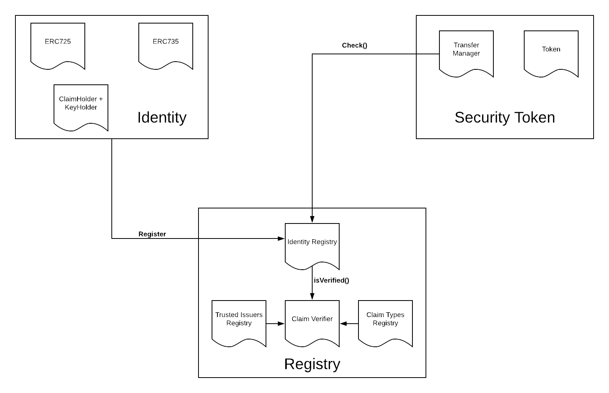
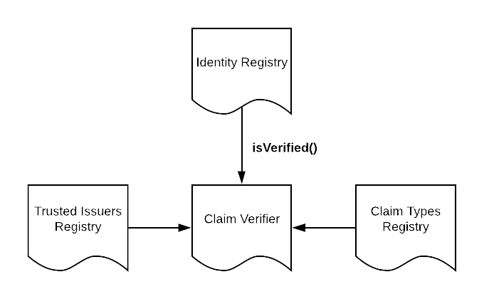

  

  

# T-REX : Token for Regulated EXchanges

With STOs being deemed as the future ICOs, security tokens still have a long way to go before taking the crypto market by storm just like utility tokens(ICOs) did in 2017. While there has been a lot of work going on this particular field of permissioned tokens, identity management is one of the biggest issues that need to be addressed to make this a success. The current off-chain identity management has its share of cons. It deviates from the concept of decentralization by depending on an off-chain validator to verify a user. The current model also doesn’t restrict the transfer of tokens to unidentified users which can be disastrous when it comes to ownership of securities. 

To tackle the above problem, one of the best solutions would be to introduce the concept of on-chain validators. Even though user-verification happens off-chain, doing the validation on-chain can provide great levels of security and trust. The major aim behind T-rex protocol is to combine permissioned tokens with proper identity management of token owners which is done by leveraging [ERC725](https://github.com/ethereum/EIPs/issues/725) and [ERC735](https://github.com/ethereum/EIPs/issues/735) standards. The token will be ERC20 standard compliant and [ERC884](https://medium.com/coinmonks/tokenising-shares-introducing-erc-884-cc491258e413) compliant.

This project describes the set of ethereum smart contracts representing Tokeny's T-REX protocol.

## How it works
T-rex protocol implements ERC-20 methods transfer() and transferFrom() with an additional check to determine whether or not a transfer should be allowed to proceed. The check is done over the identity contracts of both the sender and receiver of tokens. It is checked that whether the investors' identity contracts have the required claims in them as required by the security token. The same check is also extended to minting of tokens. In simple words, an investor's identity contract will have the required claims if only the investor is regulated(verified) based on security token's regulatory rules. For more details have a look at the T-REX Whitepaper.

## Components
For compliant trading of tokens, the trade has to validated in terms of regulated identities. We do that using the following components.
 
 

  

 

There are 3 main components:

* Security Token
* Identity
* Registry

The claim verifier is the main actor that interconnects the 3 components and plays the major role of a trade validator.

### Security Token

The transfer manager contract in this component adds extra functionality over the standard ERC20 token like overriding the transfer functions with a check, maintaining token holders and reissuance of tokens. 

#### Features
* The Security token is a basic ERC20 token with overriden transfer() and transferFrom() methods to make it trade complaint. In the transfer functions we check for the validity of the buyer and seller of the tokens based on ERC725 and ERC735 management of claims. If both the buyer and the seller are regulated identities based on the token's regulation rules, then the transfer is allowed to proceed. 

* The token also has an overriden mint function that only sends tokens to an address if that address has a valid identity based on regulation rules of the security token. This might be important if issuance of tokens involves minting.

* The token is made compliant with Delaware General Corporate Law, [Title 8](https://legis.delaware.gov/json/BillDetail/GenerateHtmlDocument?legislationId=25730&legislationTypeId=1&docTypeId=2&legislationName=SB69). For that it has the following key functions- 
  * setAddressFrozen(): Freezing addresses to stop token transfers.
  * Update and Prune shareholders: Maintains the holders of the security tokens. 
  * Cancel and Reissue: Allows the contract owner to cancel the tokens in an holder's address in case the holder has lost access to the private key and reissue the tokens to a new regulated address.
  * Get holders count: Important function as there are limits on the number of shareholders as per regulations.

### Identity

The identity contract is the core of the T-rex protocol. It leverages the ERC725 and ERC735 standards to make identity management of addresses as seamless as possible. Every investor or claim issuer has to deploy an identity contract to have an identity in the ecosystem.

The identity contract is basically two things: Key holder and a Claim holder. Keys and claims can be added, removed and updated. There are also execute and approve functions that act as a proxy to execute certain transactions.
 
 

  

 

* Keys: An identity contract acts as holder of keys having varying roles:
  * MANAGEMENT keys, which can manage the identity
  * ACTION keys, which perform actions in this identities name (signing, logins, transactions, etc.)
  * CLAIM signer keys, used to sign claims on other identities which need to be revocable.
  * ENCRYPTION keys, used to encrypt data e.g. hold in claims. 

  Depending on the role of an address, there needs to be a specific key type in the identity contract. For example, a claim issuer that signs a particular claim must have a claim signer key in its identity contract. To execute a transfer of ether, an address needs to have an action key in its identity contract.

* Claims: Claims in an identity contract are the proof of an identity. They are added upon succesful verification of an user and the user uses this as a proof that he/she is a verified(regulated) user. Claims can be signed by a 3rd party(claim issuers) or self-attested. It has the following structure:-

  * Type: The verification method used. For example, KYC, AML, Facebook/google OAUTH etc.
  * Scheme: The signing scheme used. For example, ECDSA.
  * Issuer: The identity contract address of the claim signer. The signers identity contract must contain claim signer key(which signs the claim data) for the claim to be valid.
  * Signature: This is the signature generated by the claim issuer upon succesfull verification of an address. For example, once a user has undergone succesfull KYC checks by the claim issuer, the claim issuer signs a raw data containing the user's identity address, the verification type used and some verified data using the claim signer key in its identity contract.
  * data: Some verified data. For example, can be user's name, address and age in an hashed form.
  * URI: Links to methods used for verification which happens off chain.

* Execute(): Executes an action on other contracts, or itself, or a transfer of ether.
* Approve(): Approves an execution or claim addition.

### Registry 

The registry component contains all the identity contracts of investors and claim issuers. It also stores the claim types (Verification methods like KYC, AML) used by the security token to regulate investors.
 

  

 

* Identity registry: This contract stores all the identity contracts of the investors involved. The identity contract for an investor is stored corresponding to his/her ethereum address. the registry ensures that the owner of identity contract being added is the investor himself. This is a key feature as ownership of an identity contract cannot be transferred and no one else can use your deployed identity contract taking advantage of the verified claims to gain access into the ecosystem. 
Some key features of identity registry:- 
  * Identity contract can be added, removed or updated but the access is strictly controlled to the owner.
  * isVerified(address): This function takes in address and checks whether the address' identity contract has the verified and signed claim based on security token regulation requirements. If this function returns true, then that address can be a valid security token holder. 

* Trusted Issuers Registry: This contract stores all the identity contracts of claim issuers trusted by the security token. This means that the claims in the identity contracts of the investors must have been signed by one of the claim issuers in this registry for the claims to be considered valid. Claim issuers can be added, removed, updated but access is strictly controlled.

* Claim Types registry: This contract stores the trusted verification methods the security token supports. For example, if the values 2 and 3 are stored in this registry where 2 means KYC and 3 means AML, the verified claims in the investor's identity contract must have claim types 2 or 3, i.e. the investor must have undergone KYC or AML checks. Claim types can be added, removed, updated but access is strictly controlled. 

* Claim Verifier: This contract checks for validity of the claims in an investor's identity contract. This is done by 4 following steps:
  1. Fetch trusted claim issuers.
  2. Fetch trusted claim Types.
  3. Fetch investor's identity contract.
  4. Check whether the investor's identity contract contains claims of claim Types from step 2 and is signed by a claim issuer from step 1.

# Developers

The project is created with truffle. Hence all truffle commands will work.

## Setup

Install dependencies `npm install`.

## Run tests

`npm run test`

In case the command breaks, it may be due to node versioning issues. 

Run `npm rebuild` and then run `npm run test` again.

## Understanding Token Transfer

If you want to understand how the compliant transfer takes place and the steps involved, visit this [link](https://github.com/tokenyICO/T-rex/tree/master/docs/README.md).
